<p align="center">
  
</p>

<p align="center">
  <a href="https://github.com/nibir-ai/AuraOs/actions"></a>
  <a href="https://github.com/nibir-ai/AuraOs/actions"></a>
  <a href="https://github.com/nibir-ai/AuraOs/releases"></a>
  <a href="LICENSE"></a>
</p>

---

# 🔵 AuraOS — Google-Integrated Desktop

**AuraOS** is a next-generation Linux distribution designed to bring the seamless, identity-centric experience of Android and ChromeOS to a powerful, fully-featured GNOME desktop environment. 

By linking your local operating system credentials directly to your Google Identity, AuraOS bypasses traditional local authentication. The entire OS is backed by **Google Gemini** as a first-class, background system service, orchestrating tasks, files, and integrations across Gmail, Google Calendar, and Google Drive.

---

## 🟢 Features & Highlights

*   **🌐 Unified Google Single Sign-On (SSO):** A custom PAM module (`pam-google`) that replaces standard password verification with Google OAuth credential checks.
*   **✨ Gemini System Daemon:** A background assistant service (`gemini-daemon`) hooked directly into your session's D-Bus bus, bringing AI assistance to GNOME Shell, terminal sessions, and local applications.
*   **🎨 Material You & Glassmorphic UI:** Modern desktop workspace featuring Dark Mode by default, dynamic system accent colors, and a customized glassmorphism setup wizard.
*   **🔄 Account & Profile Syncing:** Automatic synchronization of your high-resolution Google avatar (`~/.face`), contact preferences, and profile locales via the Google People API.
*   **🔒 Secured Sandbox Confinement:** AppArmor containment profiles restricting the execution environment of OAuth PKCE auth helpers and the system daemon to enforce maximum security.

---

## 🟡 System Architecture

AuraOS is orchestrated across multiple independent layers. User interface clients communicate with the core Rust daemon via D-Bus session interfaces, which in turn tunnels requests through an encrypted gRPC proxy in Google Cloud Run to hit the Gemini API.

```
┌────────────────────────────────────────────────────────┐
│                   GNOME Shell UI Layer                 │
│  ┌───────────────────────┐   ┌──────────────────────┐  │
│  │ GNOME Shell Extension │   │ Custom GTK4 Welcome  │  │
│  │   (TypeScript Panel)  │   │  (Glassmorphism Card)│  │
│  └───────────┬───────────┘   └───────────┬──────────┘  │
└──────────────┼───────────────────────────┼─────────────┘
               │                           │
               └─────────────┬─────────────┘
                             │
                      D-Bus (Session Bus)
              com.auraos.GeminiAssistant Interface
                             │
┌────────────────────────────▼───────────────────────────┐
│                     gemini-daemon                      │
│            (Rust, async Tokio runtime)                 │
│                                                        │
│  ┌──────────────────────────────────────────────────┐  │
│  │           Tool Orchestrator Engine (MCP)         │  │
│  │       📧 Gmail  |  📅 Calendar  |  📁 Drive      │  │
│  └──────────────────────────────────────────────────┘  │
└────────────────────────────┬───────────────────────────┘
                             │
                      TLS 1.3 / gRPC
                             │
┌────────────────────────────▼───────────────────────────┐
│                  aura-cloud Backend                    │
│      (Go Server — GCP Cloud Run Container Proxy)       │
└────────────────────────────┬───────────────────────────┘
                             │
┌────────────────────────────▼───────────────────────────┐
│                   Google Gemini API                    │
└────────────────────────────────────────────────────────┘
```

---

## 🔴 Component Grid

The AuraOS ecosystem is partitioned into these highly optimized modules:

| Module | Directory | Language | Description |
|:---|:---|:---|:---|
| **PAM Authenticator** | [`pam-google/`](file:///c:/Users/Nibir/AuraOs/pam-google) | `C` | Verifies Google credentials and manages PAM sessions. |
| **PKCE Login Helper** | [`aura-auth-helper/`](file:///c:/Users/Nibir/AuraOs/aura-auth-helper) | `Rust` | Handles OAuth 2.0 PKCE authentication flow inside a GtkWindow. |
| **Token Rotator** | [`aura-token-refresh/`](file:///c:/Users/Nibir/AuraOs/aura-token-refresh) | `Rust` | A systemd user timer that manages secure credential rotations. |
| **Profile Sync** | [`aura-profile-sync/`](file:///c:/Users/Nibir/AuraOs/aura-profile-sync) | `Rust` | Syncs Google user data (display name, language, `.face` avatar). |
| **Gemini Daemon** | [`gemini-daemon/`](file:///c:/Users/Nibir/AuraOs/gemini-daemon) | `Rust` | Orchestrates context, coordinates tool calls, and exposes a D-Bus API. |
| **Aura Command Line** | [`aura-cli/`](file:///c:/Users/Nibir/AuraOs/aura-cli) | `Rust` | CLI query interface to interface with the system assistant. |
| **Cloud Proxy Backend** | [`aura-cloud/`](file:///c:/Users/Nibir/AuraOs/aura-cloud) | `Go` | A stateless Cloud Run gRPC server that holds API keys & enforces quotas. |
| **GNOME Integration** | [`gnome-shell-extension/`](file:///c:/Users/Nibir/AuraOs/gnome-shell-extension) | `TypeScript` | Adds visual slide-out drawer, quick settings switcher, and notifications. |

---

## 🔵 Base Distribution Specifications

AuraOS is built on top of a highly refined base image:
*   **Operating System Base:** Ubuntu 26.04 LTS (*Resolute Raccoon*)
*   **Desktop Shell:** GNOME 46 (customized schemas and overrides)
*   **Kernel Branding:** Branded Aura Kernel (based on Ubuntu HWE 6.8+)
*   **Display Compositor:** Wayland-first session (Mutter compositor)
*   **Init Manager:** systemd 255+
*   **Default Confinement:** AppArmor profiles for daemon isolation

---

## 🟢 Compilation & Build Guide

### Prerequisites

To compile AuraOS locally, prepare the following dependencies in your development environment:
*   **Rust Toolchain:** Rust 1.75+ (via rustup)
*   **Go Environment:** Go 1.22+
*   **Node.js Runtime:** Node.js 20+ (with npm)
*   **Build Essentials:** GCC, CMake, `pkg-config`
*   **System Libraries:** `libpam-dev`, `libsecret-1-dev`, `libcurl4-openssl-dev`, `libjson-c-dev`, `libdbus-1-dev`, `libssl-dev`, `libgtk-4-dev`, `libadwaita-1-dev`
*   **Protobuf Compilers:** `protobuf-compiler`

---

### Step-by-Step Build Commands

<details>
<summary><b>🛠️ Compiling All Binaries</b></summary>

Compile and assemble all target binaries into the `build/` workspace:
```bash
make all
```
</details>

<details>
<summary><b>📦 Compiling Individual Components</b></summary>

You can build specific layers of the system independently:
```bash
make pam-google          # Build PAM module
make aura-auth-helper    # Build PKCE sign-in helper
make aura-token-refresh  # Build background token refresher
make aura-profile-sync   # Build account metadata synchronizer
make gemini-daemon       # Build core Rust D-Bus assistant daemon
make aura-cli            # Build CLI command terminal tool
make aura-cloud          # Build Go Cloud Run backend proxy
make gnome-extension     # Build GNOME shell panel extension
```
</details>

<details>
<summary><b>🗂️ Generating Debian Packages</b></summary>

Package the binaries into installable `.deb` archives:
```bash
make deb
```
</details>

<details>
<summary><b>💿 Building the Bootable ISO Image</b></summary>

Bootstrap the custom Ubuntu base image, overlay files, and construct a hybrid UEFI/BIOS bootable installer ISO:
```bash
make iso
```
</details>

---

## 🟡 Folder structure

```
AuraOs/
├── .github/workflows/      # Automated CI/CD test and deployment pipelines
├── apparmor/               # Sandboxing configuration profiles
├── aura-auth-helper/       # Rust OAuth 2.0 PKCE client application
├── aura-cli/               # CLI terminal assistant program
├── aura-cloud/             # Go gRPC Cloud Run backend gateway
├── aura-installer/         # GTK4/Libadwaita system setup application
├── aura-profile-sync/      # Background Google People API avatar synchronization
├── aura-token-refresh/     # Systemd system credential rotation service
├── branding/               # Brand artwork assets and SVG banners
├── config/                 # Default desktop, pam, and terminal configurations
├── dbus/                   # D-Bus interfaces and autostart registration rules
├── gemini-daemon/          # Main async system intelligence agent
├── gnome-shell-extension/  # GNOME Shell TypeScript notification panel integration
├── iso-build/              # debootstrap packaging overlay and ISO builder scripts
├── packaging/              # Debian structure rules for package compiler
├── pam-google/             # Google PAM authentication logic in C
├── proto/                  # Common Cloud protobuf service declarations
└── systemd/                # Service timer and daemon unit files
```

---

<p align="center">
  <sub>Developed by <b>AuraOS Contributors</b> • Licensed under <b>GNU GPL v3.0</b></sub>
</p>
